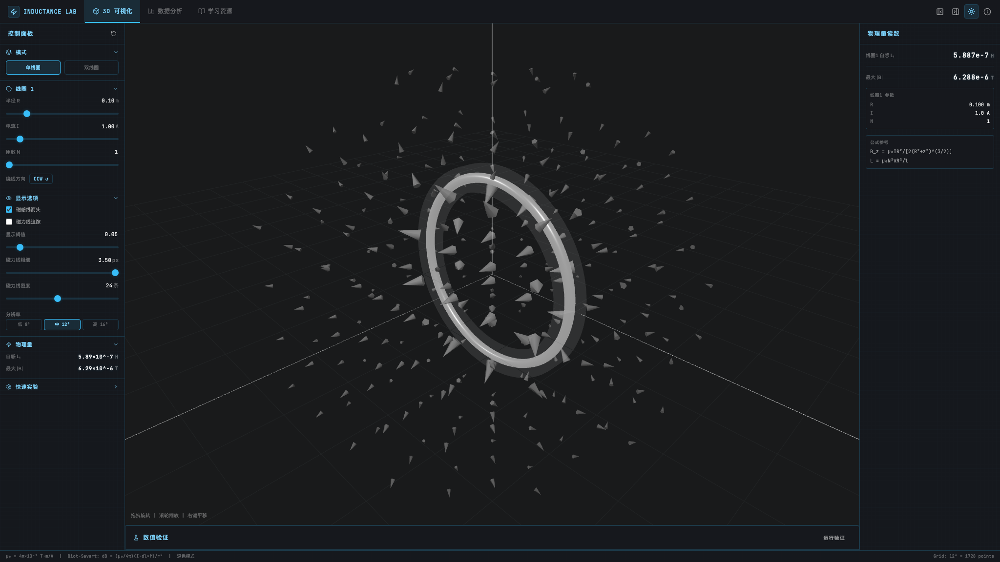
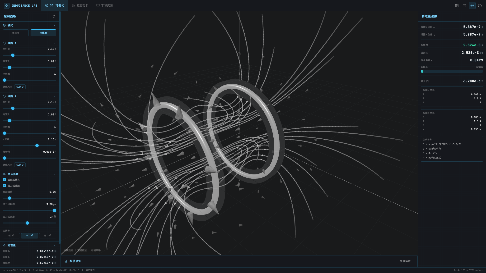
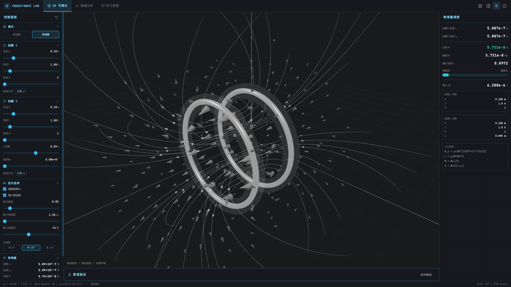
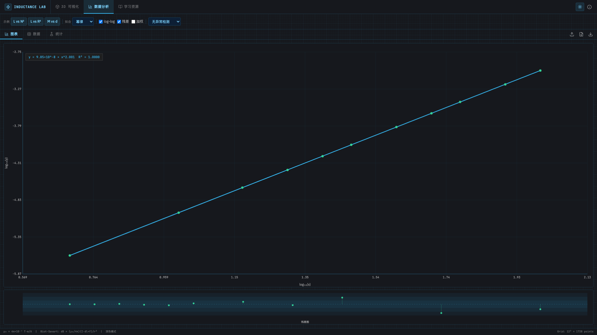

# Inductance Lab

> 面向大学物理与电磁学教学的自感、互感与磁场可视化实验平台。

<p>
  
  
  
  
  
  
</p>

Inductance Lab 使用 Biot-Savart 定律构建交互式 3D 磁场场景，支持单线圈、双线圈、磁感线箭头、磁力线追踪、互感读数、数据拟合与学习资源。它不是普通的 3D 展示页面，而是带有数值计算、可视化约束、回归测试和教学流程的完整工程。



## Highlights

| 模块 | 能力 |
| --- | --- |
| 3D 可视化 | 基于 Three.js 渲染线圈、磁场箭头、磁力线和实验网格 |
| 双线圈系统 | 支持半径、电流、匝数、z 位置、绕线方向和耦合读数 |
| 系统级磁力线 | 同轴双线圈使用轴对称磁通函数等值线生成，避免局部追踪打结 |
| 数据分析 | 内置 L vs N²、L vs R²、M vs d 示例数据和拟合曲线 |
| 教学解释 | 集成 Biot-Savart、自感、互感、法拉第感应定律说明 |
| 工程验证 | 覆盖双线圈打结、z=0.09m 锯齿、常见间距 sweep 等回归测试 |

## Live Screenshots

### 双线圈磁力线追踪

双线圈模式下，磁力线不是把两个单线圈的局部线条简单叠加，而是从整个同轴系统的磁通结构生成。



### z = 0.09m 近距离回归场景

该场景用于验证近距离双线圈不会出现非物理锯齿、局部折返或磁力线打结。



### 数据拟合分析

内置示例数据可用于观察自感与匝数、半径，以及互感与距离的关系。



## Why It Matters

传统教学演示通常只显示单线圈磁场或静态示意图。Inductance Lab 进一步处理了真实交互场景中的数值和视觉问题：

- 磁场由离散线圈段的 Biot-Savart 计算得到。
- 双线圈磁力线优先按整个系统的磁通等值线生成。
- 近距离耦合时会过滤非物理尖角、局部自交和紧凑折返。
- 物理读数、3D 可视化和数据拟合在同一界面中联动。

## Tech Stack

- React 19
- TypeScript
- Vite
- Three.js
- Tailwind CSS
- Express
- Vitest

## Quick Start

### Requirements

- Node.js 20 或更高版本
- pnpm 10

项目声明的包管理器：

```bash
pnpm@10.4.1
```

### Install

```bash
pnpm install
```

### Development

```bash
pnpm run dev
```

打开终端输出中的本地地址，通常为：

```text
http://localhost:3000/
```

### Production Build

```bash
pnpm run build
pnpm run start
```

## Usage Workflow

1. 打开应用后点击 `开始探索`。
2. 在顶部选择 `3D 可视化`。
3. 在左侧控制面板选择 `单线圈` 或 `双线圈`。
4. 调整线圈半径、电流、匝数、双线圈 z 位置和绕线方向。
5. 在 `显示选项` 中打开 `磁感线箭头` 或 `磁力线追踪`。
6. 在右侧物理量读数面板观察 `L1`、`L2`、`M`、`Phi`、`k` 和最大磁场。
7. 切换到 `数据分析`，加载示例数据并查看拟合曲线、残差和统计结果。

## Scripts

```bash
pnpm run dev      # 启动 Vite 开发服务器
pnpm run build    # 构建前端并打包服务端入口
pnpm run start    # 启动生产构建
pnpm run preview  # 预览 Vite 构建产物
pnpm run check    # TypeScript 类型检查
pnpm run format   # 使用 Prettier 格式化
```

运行磁力线相关测试：

```bash
pnpm exec vitest run client/src/lib/fieldLines.test.ts
```

## Project Structure

```text
client/
  src/
    components/          # UI 与 3D 可视化组件
    lib/
      physics.ts         # Biot-Savart、互感、自感、磁通计算
      fieldLines.ts      # 磁力线生成与系统级磁通等值线逻辑
      fieldLines.test.ts # 磁力线稳定性测试
    pages/               # 页面入口
docs/
  images/                # README 运行截图
server/
  index.ts               # Express 生产服务入口
shared/                  # 前后端共享常量
```

## Physics Model

项目使用 SI 单位：

| 物理量 | 单位 |
| --- | --- |
| 半径、位置、圈距 | meter |
| 电流 | ampere |
| 磁场 | tesla |
| 磁通 | weber |
| 电感 | henry |

核心公式：

```text
dB = (mu0 / 4pi) * (I * dl x r_hat) / r^2
Bz = mu0 * I * R^2 / [2 * (R^2 + z^2)^(3/2)]
L  = mu0 * N^2 * A / l
M  = Phi21 / I1
k  = M / sqrt(L1 * L2)
```

## Verification

建议在提交前运行：

```bash
pnpm exec vitest run client/src/lib/fieldLines.test.ts
pnpm run check
pnpm run build
```

当前测试重点覆盖：

- 单线圈磁力线有限性、边界和方向一致性。
- 双线圈同向/反向配置稳定性。
- 同轴双线圈系统级磁通线无自交、无局部打结。
- 近距离双线圈 `z = 0.09m` 锯齿回归。
- 常见 z 间距 sweep：`0.07m` 到 `0.20m`。

## License

This project is licensed under the MIT License. See [LICENSE](./LICENSE) for details.
